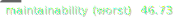

# Codehawk CLI

Codehawk is a static analysis tool for JavaScript projects. It is intended as a warning system, to identify complex areas of code that need special attention by developers.




## Scope

*JavaScript, TypeScript and Flow* projects are supported for analysis. The CLI tool supports unix and windows filesystems (there is a reasonable amount of Windows compatibility code).

It works by traversing a directory and discovering all supported filetypes, runs a static analysis routine on each file, then performs project-wide analysis such as inter-dependency counting and test coverage mapping.

The CLI runs as a Node.js process. Node.js >=12 is recommended, but >=10 should also work. <10 is unsupported.

## Usage

The simplest way to use codehawk-cli is to use it against a directory in your project:

1. `npm install --save-dev codehawk-cli` or `yarn add --dev codehawk-cli`

2. Add a `codehawk.json` to the root of your project, for example:

```json
{
    "skipDirectories": ["/node_modules", "coverage"]
}
```

3. Add a new script to `package.json`, for example: `"codehawk": "codehawk src"`

4. Run `npm run codehawk` and get output to stdout


Also see [an example using Next.js](https://github.com/sgb-io/codehawk-cli-example).

#### Example output

```markdown
Codehawk Static Analysis Results
Top 14 files

| File                                               | # of Lines | Times Used/Depended On | Maintainability (higher is better) |
| -------------------------------------------------- | ---------- | ---------------------- | ---------------------------------- |
| /test/codehawk.test.js                             | 149        | 1                      | 45.3 (Needs improvement)           |
| /src/util.ts                                       | 143        | 4                      | 47.26 (Needs improvement)          |
| /src/codehawk.ts                                   | 122        | 2                      | 47.94 (Needs improvement)          |
| /src/options.ts                                    | 72         | 2                      | 52.64 (Could be better)            |
| /src/analyze.ts                                    | 67         | 3                      | 54.04 (Could be better)            |
| /src/cli-util.ts                                   | 63         | 2                      | 54.68 (Could be better)            |
| /src/traverseProject.ts                            | 51         | 2                      | 56.91 (Could be better)            |
| /src/reporters/escomplex.ts                        | 43         | 2                      | 57.44 (Could be better)            |
| /src/badge.ts                                      | 45         | 2                      | 58.09 (Could be better)            |
| /test/options.test.js                              | 47         | 1                      | 58.55 (Could be better)            |
| /src/dependencies.ts                               | 40         | 2                      | 58.7 (Could be better)             |
| /src/coverage.ts                                   | 21         | 2                      | 60.75 OK                           |
| /src/index.ts                                      | 20         | 1                      | 60.97 OK                           |
```

## Advanced usage

Analyze an entire directory:

```javascript
const { analyzeProject } = require('codehawk-cli')

const output = analyzeProject('/path/to/project') // returns a Results object

// Get summary maintainability scores
const {
    average,
    median,
    worst,
} = output.summary
```

Analyze a single piece of code:

```javascript
const { calculateComplexity } = require('codehawk-cli')

const STATIC_SAMPLE = `
    import lodash from 'lodash';

    const chunkIntoFives = (myArr) => {
        return _.chunk(myArr, 5);
    }

    export default chunkIntoFives;
`

const metrics = calculateComplexity(STATIC_SAMPLE)

console.log(metrics) // Inspect the full metrics

```

## More information

Codehawk depends on `typhonjs-escomplex` for low level complexity metrics.

Flow is supported via `flow-remove-types` and typescript is supported via `@babel/plugin-transform-typescript`. In other words, it transforms any flow or TypeScript code into JavaScript code before static analysis is carried out.

Each analyzed file in your project ends up with:

- `codehawkScore` - A Codehawk score which represents it's estimated level of maintainability (0-100, higher is better)
- `dependencies` - a map of this file's dependecies
- `timesDependedOn` - number of times this file is imported by other files
- `complexityReport` - various detailed complexity metrics such as halstead metrics and cyclomatic complexity

## Options

To customise your analysis, use the following options, placed in a `codehawk.json` file in the root directory.

| Option               | Description                                                                                                                                                                                                                                                                  | Default                                         |
|----------------------|------------------------------------------------------------------------------------------------------------------------------------------------------------------------------------------------------------------------------------------------------------------------------|-------------------------------------------------|
| `enableFlow`         | Enable Flow support                                                                                                                                                                                                                                                          | `false`                                         |
| `extensions`         | File extensions that should be analyzed. The default is always used, but you can add more extensions. You can use the `exclude[...]` options to exclude specific files.                                                                                                      | `['.js', '.jsx', '.ts', '.tsx']`                |
| `excludeFilenames`   | Filename matches that should be excluded from static analysis (but still show in the data). The default is always used, but you can add more matches to be excluded. Note that the matching is exact. The exclude list is taken into consideration after the extension list. | `['.d.ts', '.min.js', '.bundle.js']`            |
| `excludeDirectories` | Directory matches that should be excluded from static analysis (but still show in the data). Relative to the root. E.g. `['/fixtures', '/test']`                                                                                                                             | `['/dist', '/bin', '/build']`                   |
| `skipDirectories`    | Directories that should be excluded completely, i.e. not visible in the resulting data at all. The defaults will always be skipped.                                                                                                                                          | `['/node_modules', '/flow-typed', '/coverage']` |

## Badges

By default, codehawk-cli generates 2 badges (in `generated/*.svg`) when called via the main CLI interface:

- Average: the average maintainbility score of all targeted source code
- Worst: the worst case score in the targeted source code

A higher score is better (simpler, more maintainable code).

To avoid generating badges, use the `--no-badge` option.

## Complexity Metrics

Codehawk gathers various complexity metrics, including:

- *Lines of code*: Both physical (the number of lines in a module or function) and logical (a count of the imperative statements). A crude measure.
- *Number of parameters*: Analysed statically from the function signature, so no accounting is made for functions that rely on the arguments object. Lower is better.
- *Cyclomatic complexity*: Defined by Thomas J. McCabe in 1976, this is a count of the number of cycles in the program flow control graph. Effectively the number of distinct paths through a block of code. Lower is better.
- *Cyclomatic complexity density*: Proposed as a modification to cyclomatic complexity by Geoffrey K. Gill and Chris F. Kemerer in 1991, this metric simply re-expresses it as a percentage of the logical lines of code. Lower is better.
- *Halstead metrics*: Defined by Maurice Halstead in 1977, these metrics are calculated from the numbers of operators and operands in each function. Lower is better.
- *Maintainability index*: Defined by Paul Oman & Jack Hagemeister in 1991, this is a logarithmic scale from negative infinity to 171, calculated from the logical lines of code, the cyclomatix complexity and the Halstead effort. Higher is better.

## Caveats

- Not intended for production. The project should be considered slow and experimental, but is designed to read your production code!
    - Will not run quickly on large projects, so use caution and common sense when applying it to a workflow or pipeline.
    - Recursively traverses directory trees, so if one activates the process inside a node_modules or C drive directory (unintended usage), you are likely to experience problems.
- Opinionated: the formula for calculating overall file "scores" is arbitrary and based on original, unpublished research. Users are free to interpret the numbers differently and generate their own scorings.
- Internal quality needs improvement: I envision moving the source to TypeScript if there is user interest. The tests are also rudimentary and difficult to maintain.
- `codehawk.json` configuration files are currently required. However, they can be empty.

## Testing and Samples

"Samples" contains 4 fake and 1 real project for the purposes of testing the cli tool.

Sweetalert in this directory is a static export (carried out in 2019) of that library.

Each sample conatins an empty `codehawk.json` configuration file (at present, this config)

## Known Issues

Non-latin (or certain unicode?) characters such as \u2019 confuse `flow-remove-types`, see https://github.com/facebook/flow/issues/8060
